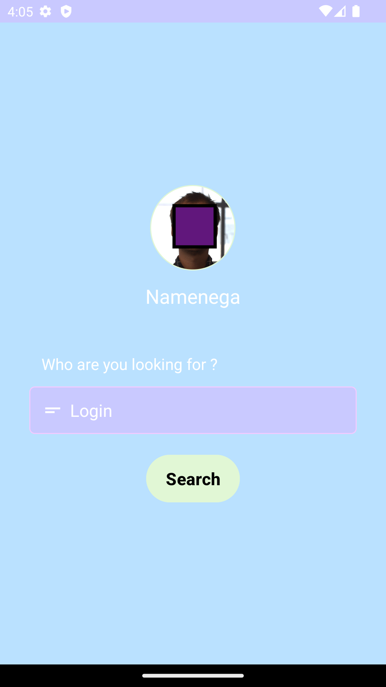
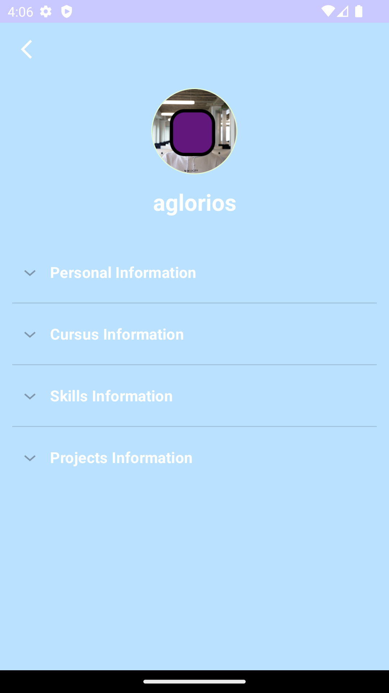
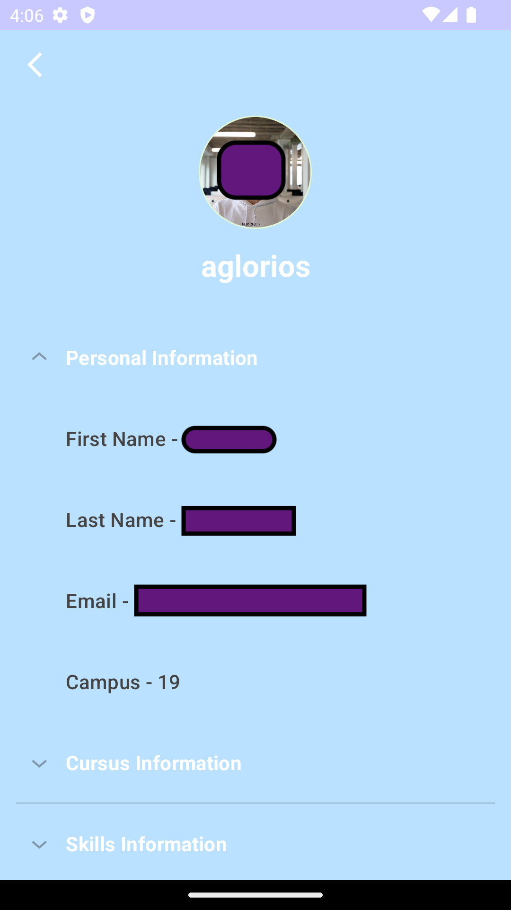
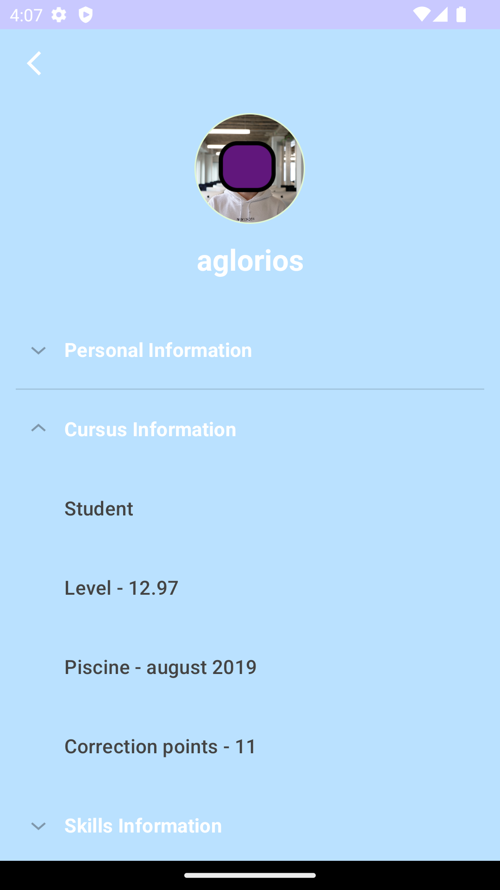
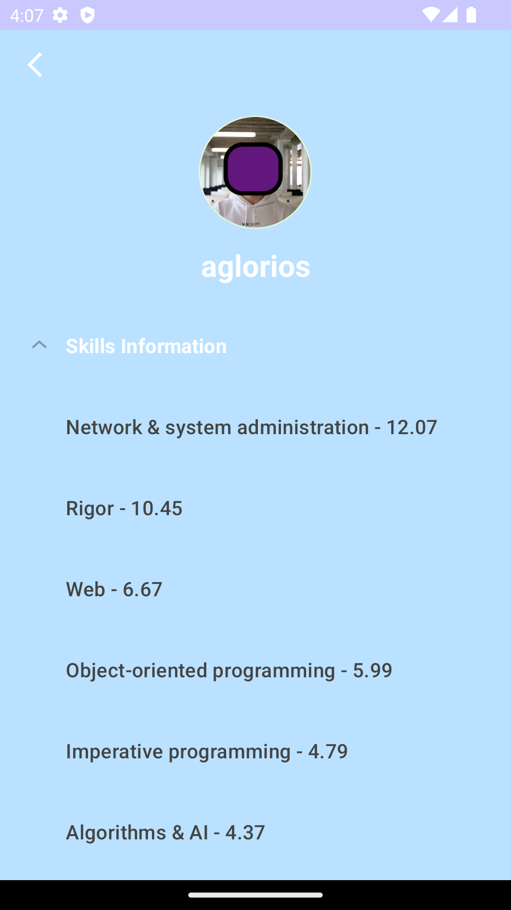
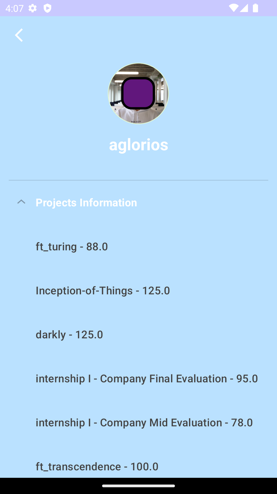

# SwiftyCompanion

---

Simple project in `Kotlin` with `Android Studio`. The goal is to make API call on the 42 API and displays information about students.

---

## First Activity

Connection portal to 42 intranet

---

## Second Activity

Connected on our own profile

---

## Third Activity

View on student page

