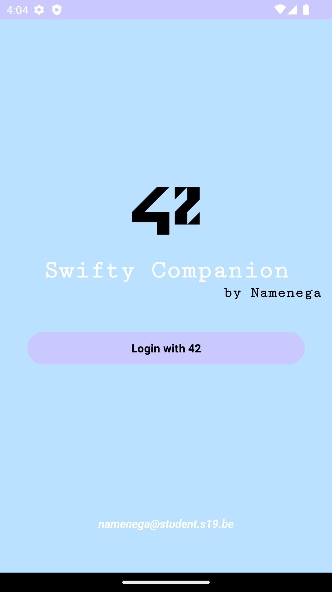

# SwiftyCompanion

---

Simple project in `Kotlin` with `Android Studio`. The goal is to make API call on the 42 API and displays information about students.

---

#### First Activity

Connection portal to 42 intranet

{ width=60%,height:30px }
